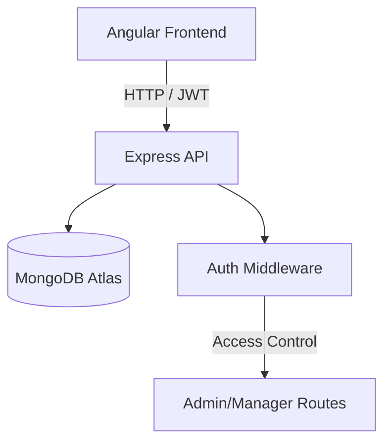

# 🧩 MEAN ERP — Small ERP System (MongoDB, Express, Angular, Node)

A **full-stack ERP system** built with the **MEAN stack** (MongoDB, Express.js, Angular, Node.js) and **TypeScript** — designed to demonstrate full production-grade skills for authentication, role-based access, CRUD operations, Docker, testing, and deployment.

> This project is part of my full-stack portfolio — built from scratch step-by-step as a practical guide to creating a real-world small ERP.

---

## 🚀 Features (MVP)

### 🔐 Authentication & Authorization
- JWT-based auth with **refresh tokens**
- **Role-Based Access Control (RBAC)** — Admin / Manager / Employee
- Route guards on backend (Express) and frontend (Angular)

### 📦 Inventory Module
- CRUD operations for **Products**
- Tracks stock quantity, SKU, price, reorder level
- Pagination & search

### 💰 Sales Module
- Customers, Orders, Invoices (minimal MVP)
- Order summary and sales tracking

### 📊 Dashboard
- KPIs: Total sales (30d), low-stock items, recent orders
- Charts & summaries (Angular Material / Chart.js)

---

## 🧠 Tech Stack

| Layer        | Technologies Used |
|---------------|------------------|
| **Frontend**  | Angular 17+, TypeScript, Angular Material / Tailwind, RxJS |
| **Backend**   | Node.js (LTS), Express.js, Mongoose, JWT, bcrypt, helmet, morgan |
| **Database**  | MongoDB Atlas |
---

## 🏗️ Project Structure

```
erp-mean/
│
├── backend/              # Node + Express + MongoDB
│   ├── src/
│   │   ├── controllers/
│   │   ├── middleware/
│   │   ├── models/
│   │   ├── routes/
│   │   ├── utils/
│   │   └── server.js
│   ├── .env.example
│   ├── Dockerfile
│   └── package.json
│
├── frontend/             # Angular app
│   ├── src/app/
│   │   ├── core/
│   │   ├── auth/
│   │   ├── products/
│   │   ├── orders/
│   │   └── shared/
│   └── angular.json
│
└── docker-compose.yml
```

---

## ⚙️ Backend Setup

### 1️⃣ Install dependencies
```bash
cd backend
npm install
```

### 2️⃣ Environment Variables
Create a `.env` file (see `.env.example`):
```bash
PORT=5000
MONGO_URI=mongodb://localhost:27017/erp
JWT_ACCESS_SECRET=replace_with_strong_secret
JWT_REFRESH_SECRET=replace_with_strong_secret
CLIENT_URL=http://localhost:4200
```

### 3️⃣ Run backend (dev)
```bash
npm run dev
```

---

## 💻 Frontend Setup

### 1️⃣ Create & install
```bash
cd frontend
npm install
```

### 2️⃣ Run Angular app
```bash
ng serve
```
Frontend runs on `http://localhost:4200`

---

## 🧱 Docker (optional, for local orchestration)
---

## 🔒 Security Highlights
- HTTPS-ready setup
- Helmet, CORS, rate limiting
- Strong password hashing (bcrypt 12 rounds)
- JWT rotation and short expiry
- Secure cookie handling for refresh tokens
- Input validation with express-validator
- Prevents NoSQL injection and XSS via sanitization

---

## 🧰 CI/CD

- GitHub Actions or Render auto-deploy  
- Run backend tests on push  
- Auto build & deploy frontend to **Vercel**  
- Environment variables configured via dashboard

---

## 🧩 Architecture Overview



---

## 🧠 References

- [Node.js LTS Schedule](https://nodejs.org/en/about/releases/)
- [Angular Documentation](https://angular.dev)
- [MongoDB Docs](https://www.mongodb.com/docs/)
- [OWASP JWT Best Practices](https://owasp.org/www-project-cheat-sheets/cheatsheets/JSON_Web_Token_Cheat_Sheet.html)
- [Render Deployment Docs](https://render.com/docs)
- [Vercel Angular Guide](https://vercel.com/docs/frameworks/angular)

---

## 👤 Author

**Robin Joseph**  
📧 [robinjo1776@gmail.com](mailto:robinjo1776@gmail.com)  
🔗 [GitHub: RobinJosephDev](https://github.com/RobinJosephDev)
